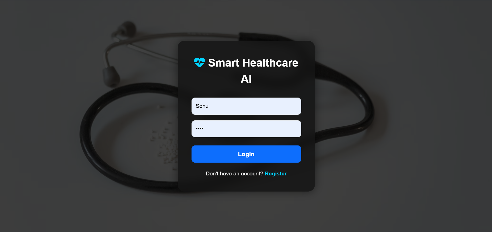
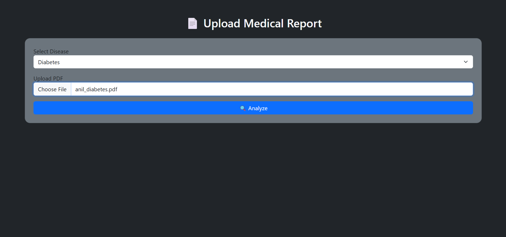
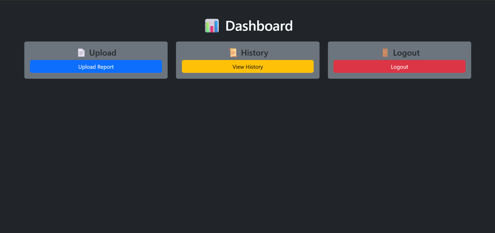
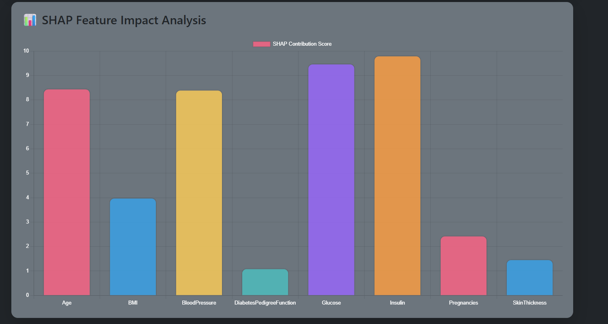

# 🏥 Smart Healthcare Risk Prediction System

An AI-powered healthcare analytics platform that analyzes medical reports, predicts disease risk, and provides explainable AI insights using OCR, Machine Learning, and SHAP Explainability.

---

# 🚀 Features

## AI Disease Prediction

- Diabetes Risk Prediction
- Heart Disease Prediction
-  Kidney Disease Prediction

## OCR-Based Medical Report Analysis

- Extracts text from scanned medical reports
- Supports PDF reports
- Handles real-world hospital reports

## Explainable AI (SHAP)

- Feature contribution visualization
- Interactive SHAP graphs
- AI explanation of predictions

## Interactive Dashboard

- Login/Register System
- Upload & Analyze Reports
- Risk Probability Meter
- Downloadable AI Report
- History Dashboard

## Modern UI

- Flask Frontend
- Responsive Dashboard
- Interactive Charts
- Medical-Themed Interface

---

#  Tech Stack

## Frontend

- Flask
- HTML
- CSS
- Bootstrap
- Chart.js

## Backend

- Flask API
- Python
- SHAP
- OCR

## Machine Learning

- XGBoost
- Random Forest
- Scikit-Learn

## OCR & PDF Processing

- Tesseract OCR
- PyMuPDF
- OpenCV
- pdf2image

---

#  Project Architecture

```text
Medical Report
      ↓
OCR + PDF Extraction
      ↓
Feature Extraction
      ↓
ML Prediction
      ↓
SHAP Explainability
      ↓
Interactive Dashboard
```

---
## 📸 Project Screenshots

### 🔐 Login Page



---

### 📄 Upload Medical Report



---

### 📊 Dashboard



---

### 🧠 SHAP Explainability Graph



# ⚙️ Installation

## 1️⃣ Clone Repository

```bash
git clone https://github.com/sonu1234827/smart-healthcare-risk-predictiong
```

---

## 2️⃣ Install Dependencies

```bash
pip install -r requirements.txt
```

---

## 3️⃣ Run Backend

```bash
cd backend
python api.py
```

---

## 4️⃣ Run Frontend

```bash
cd frontend
python app.py
```

---

# 🌐 Open Application

```text
http://127.0.0.1:8000
```

---

#  Explainable AI Dashboard

The system uses SHAP Explainability to:

- Identify important medical parameters
- Explain why predictions occurred
- Improve transparency and trust in AI predictions

---

#  Future Improvements

- Deep Learning Integration
- Multi-Disease Prediction
- Real Hospital API Integration
- Doctor Recommendation System
- Cloud Deployment
- Mobile Application

---


✅ OCR-Based Medical Analysis

✅ Explainable AI using SHAP

✅ Interactive Healthcare Dashboard

✅ Real-Time Disease Prediction

✅ Real Medical Report Support

✅ Placement-Level Major Project

---

# 👨‍💻 Author

SONU DALAI

B.Tech CSE Student

Machine Learning & AI Enthusiast

---

# ⭐ Support

If you like this project:

⭐ Star the repository

🍴 Fork the repository

📢 Share the project
